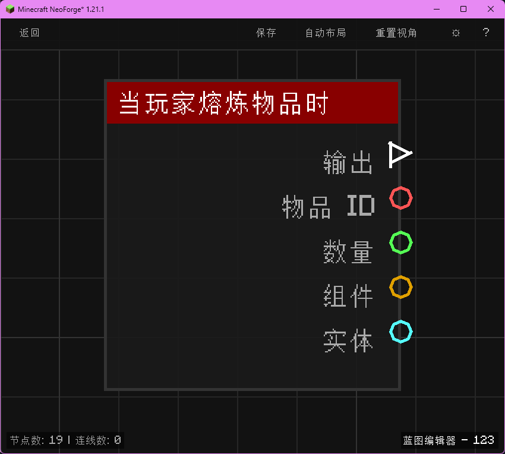

# 当玩家熔炼物品时 (on_player_smelt)

当玩家从熔炼输出取出物品时触发，输出物品 ID、数量、组件与玩家实体。

## 节点概览
- **分类**: 事件 > 玩家事件
- **内部ID**：`mgmc:on_player_smelt`
- 

## 端口定义

### 输入 (Inputs)
该节点没有输入端口。

### 输出 (Outputs)
| 端口名称 | 类型 | 说明 |
| :--- | :--- | :--- |
| **执行** (exec) | 执行流 (Exec) | 当玩家取出熔炼结果时执行后续节点。 |
| **物品 ID** (item_id) | 字符串 (String) | 玩家熔炼出的物品命名空间 ID（例如 `minecraft:iron_ingot`）。 |
| **数量** (count) | 浮点数 (Float) | 玩家本次熔炼取出的物品数量。 |
| **组件** (components) | 组件 (Components) | 物品的 NBT/组件数据（JSON 字符串形式）。 |
| **实体** (entity) | 实体 (Entity) | 取出熔炼结果的玩家实体。 |

## 行为说明
1. **主要行为**：当玩家在熔炉、高炉或烟熏炉等熔炼设备中取出熔炼完成的物品时触发，输出熔炼产物及其元数据。
2. **触发时机**：该节点对应 NeoForge 的 `PlayerEvent.ItemSmeltedEvent`，仅在玩家实际将熔炼产物“取出”到背包时触发，而不是放入原料或打开熔炉界面时。
3. **数量字段**：**数量 (count)** 以浮点数形式输出物品堆叠数量（例如 1.0、3.0）。
4. **组件字段**：**组件 (components)** 通过 `ItemComponentsCodec` 序列化物品的完整组件信息（含附魔等），返回 JSON 字符串；未设置任何组件时返回 `{}`。
5. **路由标识**：使用 `BlueprintRouter.PLAYERS_ID` 路由，每个玩家的蓝图实例独立运行。
6. **空值处理**：作为事件触发节点，输出端口在事件发生时始终有效。**物品 ID (item_id)** 始终为非空字符串。
7. **类型转换**：**实体 (entity)** 端口支持自动转换为其 UUID 字符串或名称字符串。