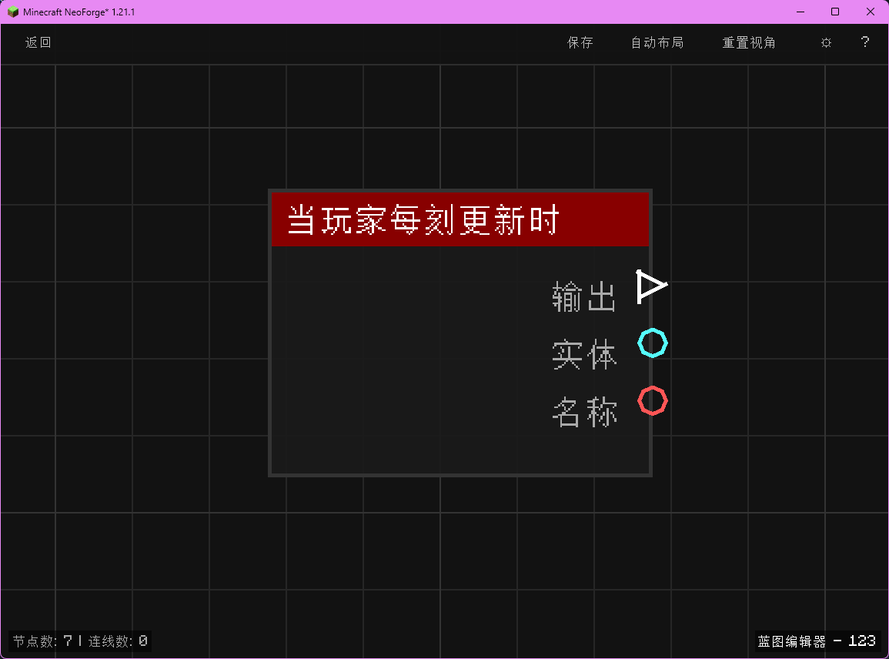

# 当玩家每刻更新时 (on_player_tick)

每游戏刻（tick）为玩家触发，输出玩家实体与名称。属于高频事件，请避免在其中放置过重逻辑。

## 节点概览
- **分类**: 事件 > 玩家事件
- **内部ID**：`mgmc:on_player_tick`
- 

## 端口定义

### 输入 (Inputs)
该节点没有输入端口。

### 输出 (Outputs)
| 端口名称 | 类型 | 说明 |
| :--- | :--- | :--- |
| **执行** (exec) | 执行流 (Exec) | 每游戏刻触发一次，供后续节点使用。 |
| **实体** (entity) | 实体 (Entity) | 当前被触发的玩家实体。 |
| **名称** (name) | 字符串 (String) | 玩家的玩家名称。 |

## 行为说明
1. **主要行为**：每个游戏刻（1/20 秒）都会为每个在线玩家触发一次，输出对应的玩家实体与玩家名称。
2. **触发时机**：该节点对应 NeoForge 的 `PlayerTickEvent.Post`，仅在玩家实际在线时触发。
3. **高频注意事项**：每刻都会执行属于高频事件，请避免在其中放置过重逻辑（如长循环、复杂计算、频繁物品操作等），否则会导致服务器 TPS 下降。建议仅配合轻量变量更新或简单判断使用。
4. **路由标识**：使用 `BlueprintRouter.PLAYERS_ID` 路由，每个玩家的蓝图运行实例相互独立，互不干扰。
5. **空值处理**：作为事件触发节点，输出端口在事件发生时始终有效。**实体 (entity)** 与 **名称 (name)** 不为空。
6. **类型转换**：**实体 (entity)** 端口支持自动转换为其 UUID 字符串或玩家名称字符串。