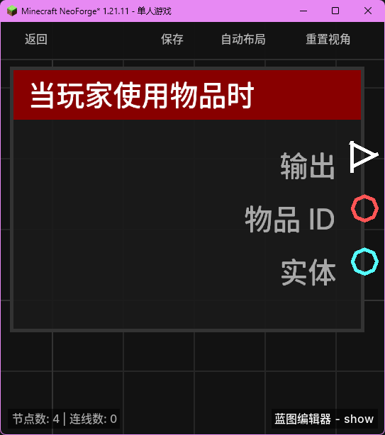

# 当玩家使用物品时 (on_use_item)

当玩家右键使用手中的物品（如食物、药水、末影珍珠等）时触发。

## 节点概览
- **分类**: 事件 > 玩家事件
- **内部ID**：`mgmc:on_use_item`
- 

## 端口定义

### 输入 (Inputs)
该节点没有输入端口。

### 输出 (Outputs)
| 端口名称 | 类型 | 说明 |
| :--- | :--- | :--- |
| **执行** (exec) | 执行流 (Exec) | 当玩家使用物品时执行后续节点。 |
| **物品 ID** (item_id) | 字符串 (String) | 玩家正在使用的物品的命名空间 ID（例如 `minecraft:apple`）。 |
| **实体** (entity) | 实体 (Entity) | 正在使用物品的玩家实体。 |

## 行为说明
1. **主要行为**：当玩家在主手或副手持有可使用物品并按下右键时，该节点将被触发。
2. **触发时机**：该节点对应 Forge 的 `PlayerInteractEvent.RightClickItem` 事件。对于某些持续使用的物品（如吃食物、拉弓），该事件通常在开始使用时触发。
3. **物品过滤**：**物品 ID (item_id)** 端口输出的是物品的注册名称。你可以配合“等于 (=)”节点来判断玩家是否使用了特定的物品，从而执行特定的逻辑。
4. **空值处理**：作为事件触发节点，输出端口在事件发生时始终有效。**物品 ID (item_id)** 将始终返回一个非空的物品 ID。
5. **类型转换**：**实体 (entity)** 端口支持自动转换为其 UUID 字符串或名称字符串。
