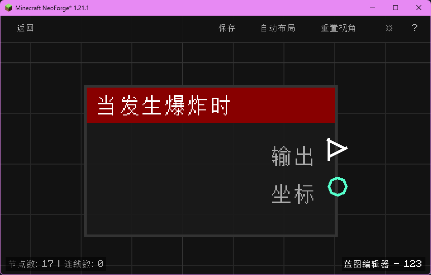

# 当发生爆炸时 (on_explosion)

当世界中发生爆炸（引爆）时触发，输出爆炸中心坐标。

## 节点概览
- **分类**: 事件 > 世界事件
- **内部ID**：`mgmc:on_explosion`
- 

## 端口定义

### 输入 (Inputs)
该节点没有输入端口。

### 输出 (Outputs)
| 端口名称 | 类型 | 说明 |
| :--- | :--- | :--- |
| **执行** (exec) | 执行流 (Exec) | 当发生爆炸时执行后续节点。 |
| **坐标** (xyz) | 坐标 (XYZ) | 爆炸中心的精确坐标向量（含 X/Y/Z 三个分量）。 |

## 行为说明
1. **主要行为**：当世界中任意类型的爆炸被引爆（TNT、苦力怕、末地水晶、爆炸动作节点、爆炸箭等）时触发，输出爆炸发生的位置。
2. **触发时机**：该节点对应 NeoForge 的 `ExplosionEvent.Detonate`，在爆炸即将对世界造成破坏前触发，可以在此处拦截或对爆炸做出反应。
3. **路由标识**：使用 `BlueprintRouter.GLOBAL_ID` 路由，作为全局蓝图运行。
4. **空值处理**：作为事件触发节点，输出端口在事件发生时始终有效。**坐标 (xyz)** 在事件触发时一定包含有效的 X/Y/Z 数值。
5. **类型转换**：**坐标 (xyz)** 端口支持自动拆分为 X、Y、Z 三个独立的浮点数输出，也可以转换为距离该点的范围搜索输入。