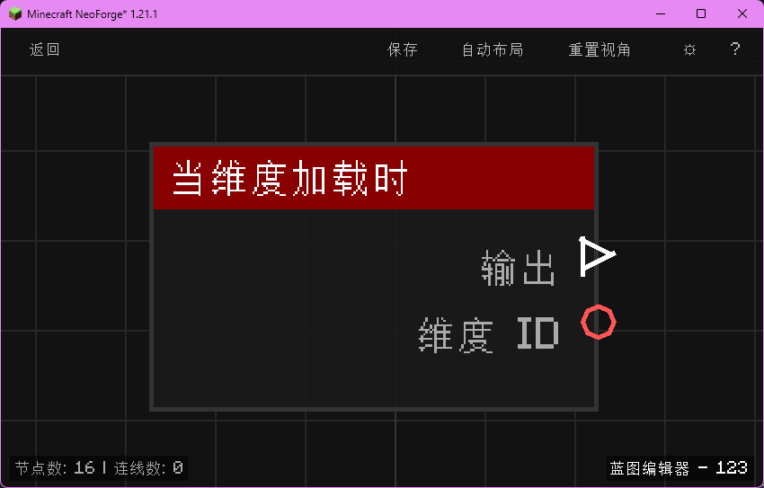

# 当维度加载时 (on_level_load)

当某个维度（世界）加载时触发，输出维度 ID。

## 节点概览
- **分类**: 事件 > 世界事件
- **内部ID**：`mgmc:on_level_load`
- 

## 端口定义

### 输入 (Inputs)
该节点没有输入端口。

### 输出 (Outputs)
| 端口名称 | 类型 | 说明 |
| :--- | :--- | :--- |
| **执行** (exec) | 执行流 (Exec) | 当维度加载时执行后续节点。 |
| **维度 ID** (dimension_id) | 字符串 (String) | 被加载维度的命名空间 ID（例如 `minecraft:overworld`、`minecraft:the_nether`）。 |

## 行为说明
1. **主要行为**：当 Minecraft 服务器加载任意维度（主世界、下界、末地或自定义维度）时触发，输出被加载的维度标识。
2. **触发时机**：该节点对应 NeoForge 的 `LevelEvent.Load`，在维度资源、世界数据加载完成、可供玩家进入时触发。
3. **触发频率**：每个维度在服务器生命周期内通常仅加载一次（首次进入时）；若维度被卸载后再次加载（例如长时间无玩家后被回收），会再次触发。
4. **路由标识**：使用 `BlueprintRouter.GLOBAL_ID` 路由，作为全局蓝图运行。
5. **空值处理**：作为事件触发节点，输出端口在事件发生时始终有效。**维度 ID (dimension_id)** 始终为非空字符串。