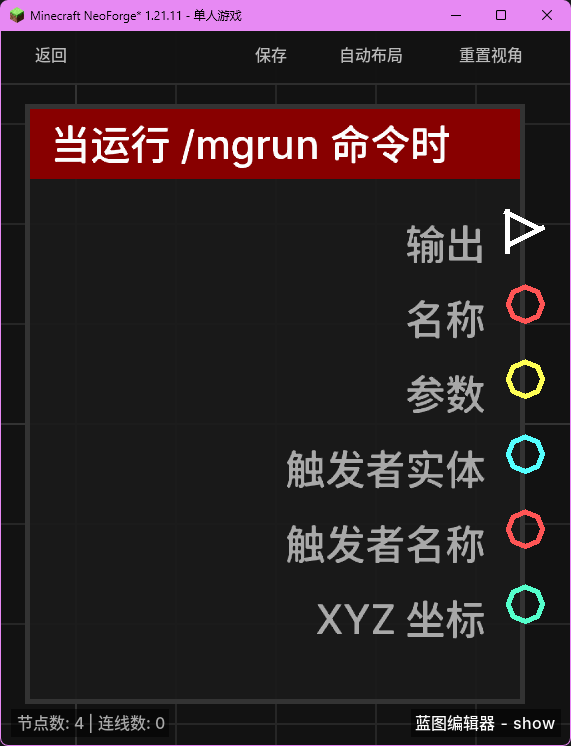

# 当运行 /mgrun 命令时 (on_mgrun)

当玩家或服务器后台执行 `/mgrun <蓝图名称> <事件名称> [参数...]` 命令时触发。

## 节点概览
- **分类**: 事件 > 世界事件
- **内部ID**：`mgmc:on_mgrun`
- 

## 端口定义

### 执行流 (Exec)
| 端口名称 | 类型 | 说明 |
| :--- | :--- | :--- |
| **执行输出** (exec_out) | 执行流 (Exec) | 命令执行时激活后续逻辑。 |

### 输出 (Outputs)
| 端口名称 | 类型 | 说明 |
| :--- | :--- | :--- |
| **名称** (name) | 字符串 (String) | 命令中传入的事件名称。 |
| **参数** (parameters) | 列表 (List) | 命令中传入的参数列表。 |
| **触发者实体** (trigger_entity) | 实体 (Entity) | 执行命令的实体（通常是玩家）。如果由控制台执行，则可能为 `null`。 |
| **触发者名称** (trigger_name) | 字符串 (String) | 执行者的显示名称。 |
| **XYZ** (xyz) | XYZ (XYZ) | 触发时的坐标位置。 |

## 行为说明
1. **命令格式**：支持在游戏中通过 `/mgrun <蓝图名称> <事件名称> [参数...]` 直接调用蓝图并传递参数。
2. **事件名称**：命令中的第二个参数（`<事件名称>`）会通过“名称”端口输出，可用于在同一个蓝图中区分不同的触发逻辑。
3. **参数处理**：命令后的所有额外内容（`[参数...]`）都会被按空格解析并放入“参数”列表中，可以通过列表相关节点读取。
4. **环境适配**：该事件提供了丰富的上下文信息（触发者、坐标等），方便实现交互式功能。
