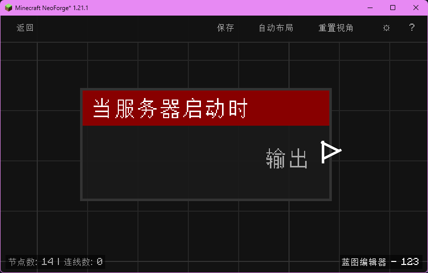

# 当服务器启动时 (on_server_start)

当 Minecraft 服务器完全启动后触发。

## 节点概览
- **分类**: 事件 > 世界事件
- **内部ID**：`mgmc:on_server_start`
- 

## 端口定义

### 输入 (Inputs)
该节点没有输入端口。

### 输出 (Outputs)
| 端口名称 | 类型 | 说明 |
| :--- | :--- | :--- |
| **执行** (exec) | 执行流 (Exec) | 服务器启动完成时执行后续节点。 |

## 行为说明
1. **主要行为**：当 Minecraft 服务器完成启动流程、世界数据加载完毕、可供玩家连接时触发一次。
2. **触发时机**：该节点对应 NeoForge 的 `ServerStartedEvent`，在服务器完全就绪后才触发，因此可以安全地在其中访问世界、玩家等数据。
3. **典型场景**：常用于服务器启动时初始化全局变量、注册周期任务、广播欢迎消息等。
4. **路由标识**：使用 `BlueprintRouter.GLOBAL_ID` 路由，作为全局蓝图运行。
5. **空值处理**：作为事件触发节点，仅含执行流输出，没有数据端口。