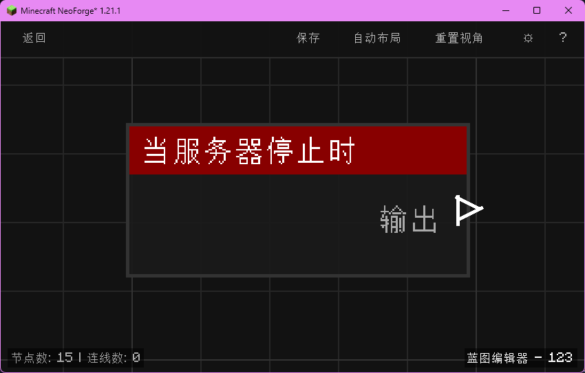

# 当服务器停止时 (on_server_stop)

当 Minecraft 服务器即将停止时触发。

## 节点概览
- **分类**: 事件 > 世界事件
- **内部ID**：`mgmc:on_server_stop`
- 

## 端口定义

### 输入 (Inputs)
该节点没有输入端口。

### 输出 (Outputs)
| 端口名称 | 类型 | 说明 |
| :--- | :--- | :--- |
| **执行** (exec) | 执行流 (Exec) | 服务器停止前执行后续节点。 |

## 行为说明
1. **主要行为**：当 Minecraft 服务器收到关闭信号、即将关闭时触发一次。
2. **触发时机**：该节点对应 NeoForge 的 `ServerStoppingEvent`（停止前阶段），在服务器正式关闭之前触发，可以在此处执行保存、广播告别消息等收尾工作。
3. **注意事项**：服务器停止事件触发后不久进程就会退出，请避免在其中放置耗时过长的逻辑，否则可能导致关闭延迟或强制终止。
4. **路由标识**：使用 `BlueprintRouter.GLOBAL_ID` 路由，作为全局蓝图运行。
5. **空值处理**：作为事件触发节点，仅含执行流输出，没有数据端口。