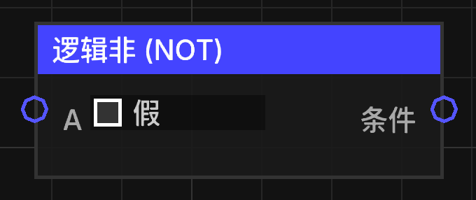

# 逻辑非 (NOT)

将输入的布尔值取反。

## 节点概览
- **分类**: 逻辑 > 布尔逻辑
- **内部ID**：`mgmc:logic_not`
- 

## 端口定义

### 输入 (Inputs)
| 端口名称 | 类型 | 说明 |
| :--- | :--- | :--- |
| **A** (a) | 布尔值 (Boolean) | 需要取反的逻辑条件。 |

### 输出 (Outputs)
| 端口名称 | 类型 | 说明 |
| :--- | :--- | :--- |
| **条件** (condition) | 布尔值 (Boolean) | 如果输入为 `true`，输出 `false`；如果输入为 `false`，输出 `true`。 |

## 行为说明
1. **逻辑运算**：执行标准的布尔“非”运算（NOT）。
2. **默认值**：如果输入未连接，默认值通常为 `false`。
3. **类型转换**：非布尔类型的输入会通过 `TypeConverter.toBoolean` 转换为布尔值。
