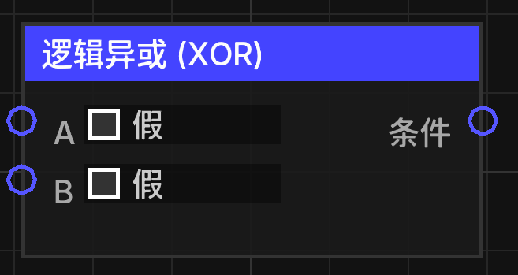

# 逻辑异或 (XOR)

当两个输入条件不相同时，输出真。

## 节点概览
- **分类**: 逻辑 > 布尔逻辑
- **内部ID**：`mgmc:logic_xor`
- 

## 端口定义

### 输入 (Inputs)
| 端口名称 | 类型 | 说明 |
| :--- | :--- | :--- |
| **A** (a) | 布尔值 (Boolean) | 第一个逻辑条件。 |
| **B** (b) | 布尔值 (Boolean) | 第二个逻辑条件。 |

### 输出 (Outputs)
| 端口名称 | 类型 | 说明 |
| :--- | :--- | :--- |
| **条件** (condition) | 布尔值 (Boolean) | 当 A 和 B 不相同时（一个为 `true`，另一个为 `false`），输出 `true`；如果 A 和 B 相同，则输出 `false`。 |

## 行为说明
1. **逻辑运算**：执行标准的布尔“异或”运算（XOR）。
2. **默认值**：如果输入未连接，默认值通常为 `false`。
3. **类型转换**：非布尔类型的输入会通过 `TypeConverter.toBoolean` 转换为布尔值。
