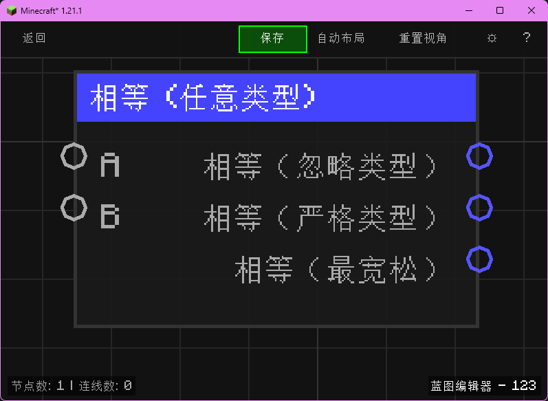

# 相等 (任意类型) (Equal (Any))

比较任意类型的两个值，并同时输出三种相等判断结果。

## 节点概览
- **分类**: 逻辑 > 比较
- **内部ID**：`mgmc:compare_any`
- 

## 端口定义

### 输入 (Inputs)
| 端口名称 | 类型 | 说明 |
| :--- | :--- | :--- |
| **A** (a) | 任意类型 (Any) | 左侧参与比较的值。 |
| **B** (b) | 任意类型 (Any) | 右侧参与比较的值。 |

### 输出 (Outputs)
| 端口名称 | 类型 | 说明 |
| :--- | :--- | :--- |
| **相等（忽略类型）** (ignore_type) | 布尔值 (Boolean) | 忽略类型的相等判断结果。 |
| **相等（严格类型）** (strict_type) | 布尔值 (Boolean) | 严格类型相等判断结果。 |
| **相等（最宽松）** (loose_type) | 布尔值 (Boolean) | 最宽松的相等判断结果。 |

## 行为说明
1. **主要行为**：节点会对输入 A、B 同时计算三种比较方式：忽略类型、严格类型、最宽松，并分别输出到对应端口。
2. **空值处理**：A 或 B 未连接时为 `null`，忽略类型与严格类型使用 `Objects.equals`（`null` 与 `null` 为真），最宽松模式会将 `null` 转为空字符串后再比较。
3. **类型转换**：忽略类型模式在两端均为数值时按 `double` 比较；严格类型在两端为数值时要求数值类型一致后再比较；最宽松模式会按规则尝试数值/布尔/字符串互转（`TypeConverter.toDouble/toBoolean/toString`）并进行等值判断。
