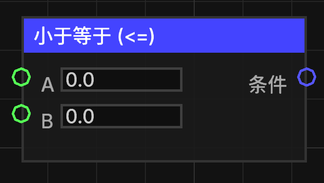

# 小于等于 (<=)

判断第一个数值是否小于或等于第二个数值。

## 节点概览
- **分类**: 逻辑 > 比较
- **内部ID**：`mgmc:compare_lte`
- 

## 端口定义

### 输入 (Inputs)
| 端口名称 | 类型 | 说明 |
| :--- | :--- | :--- |
| **A** (a) | 浮点数 (Float) | 第一个比较数值。 |
| **B** (b) | 浮点数 (Float) | 第二个比较数值。 |

### 输出 (Outputs)
| 端口名称 | 类型 | 说明 |
| :--- | :--- | :--- |
| **条件** (condition) | 布尔值 (Boolean) | 如果 A 小于或等于 B，则输出 `true`；否则输出 `false`。 |

## 行为说明
1. **数值转换**：节点会将输入 A 和 B 均转换为双精度浮点数（double）进行比较。
2. **包含等于**：当 A 小于 B 或 A 等于 B 时，均返回 `true`。
