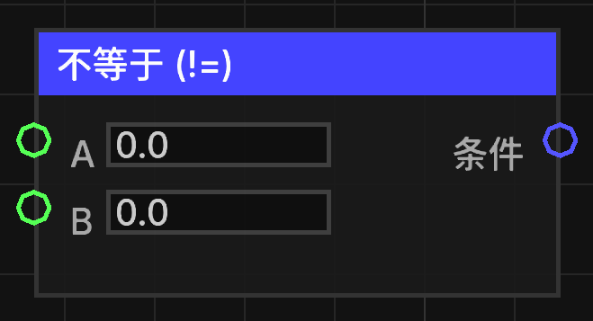

# 不等于 (!=)

比较两个数值是否不相等。

## 节点概览
- **分类**: 逻辑 > 比较
- **内部ID**：`mgmc:compare_neq`
- 

## 端口定义

### 输入 (Inputs)
| 端口名称 | 类型 | 说明 |
| :--- | :--- | :--- |
| **A** (a) | 浮点数 (Float) | 第一个比较数值。 |
| **B** (b) | 浮点数 (Float) | 第二个比较数值。 |

### 输出 (Outputs)
| 端口名称 | 类型 | 说明 |
| :--- | :--- | :--- |
| **条件** (condition) | 布尔值 (Boolean) | 如果 A 不等于 B，则输出 `true`；否则输出 `false`。 |

## 行为说明
1. **数值转换**：节点会将输入 A 和 B 均转换为双精度浮点数（double）进行比较。
2. **严格比较**：只要 A 和 B 的数值不同，即返回 `true`。
3. **类型转换**：如果输入了非数值类型，将尝试通过 `TypeConverter.toDouble` 进行转换。
