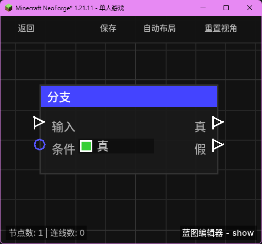

# 分支 (Branch)

**分支** 节点是流程控制中最基础的节点，类似于编程语言中的 `if` 语句。它根据输入的布尔条件，决定执行流向“真”还是“假”端口。

## 节点概览
- **分类**: 逻辑 > 流程控制
- **内部ID**：`mgmc:branch`
- 

## 端口定义

### 输入 (Inputs)
| 端口名称 | 类型 | 说明 |
| :--- | :--- | :--- |
| **输入** (Exec) | 执行流 | 触发该节点的运行。 |
| **条件** (Condition) | 布尔值 (Boolean) | 用于判断的分支条件。如果为 `true`，则执行“真”输出；如果为 `false`，则执行“假”输出。 |

### 输出 (Outputs)
| 端口名称 | 类型 | 说明 |
| :--- | :--- | :--- |
| **真** (True) | 执行流 | 当条件为 `true` 时触发。 |
| **假** (False) | 执行流 | 当条件为 `false` 时触发。 |

## 行为说明
1. **条件判定**：节点被触发时，会立即评估“条件”端口的输入值。
2. **单向流转**：执行流只会从“真”或“假”其中一个端口流出，不会同时触发。
3. **默认行为**：如果“条件”端口未连接，则使用默认设置的值（默认为 `true`）。
