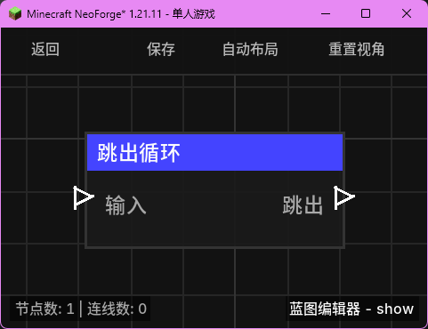

# 跳出循环 (Break Loop)

**跳出循环** 节点用于在循环体执行过程中，请求立即终止当前的循环。它通常与 `分支` 节点配合使用，以实现满足特定条件时停止循环的功能。

## 节点概览
- **分类**: 逻辑 > 流程控制
- **内部ID**：`mgmc:break_loop`
- 

## 端口定义

### 输入 (Inputs)
| 端口名称 | 类型 | 说明 |
| :--- | :--- | :--- |
| **输入** (Exec) | 执行流 | 触发该节点的运行。 |

### 输出 (Outputs)
| 端口名称 | 类型 | 说明 |
| :--- | :--- | :--- |
| **跳出** (Break) | 执行流 | 触发该输出，并将当前的循环上下文标记为“请求中断”。 |

## 行为说明
1. **中断原理**：该节点本身并不直接停止执行流，而是通过设置执行上下文中的 `breakRequested` 标志位。
2. **配合循环节点**：支持中断的循环节点（如 `有限循环`）在每一轮循环执行完“循环体”后，都会检查该标志位。如果检测到标志位为 `true`，循环将立即停止并跳转到其“循环完成”端口。
3. **放置位置**：此节点必须连接在循环节点的“循环体”执行链条中才能生效。
