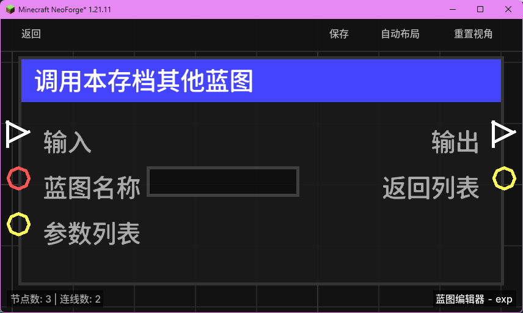

# 调用本存档其他蓝图 (Call Other Blueprint in Save)

同步调用当前存档中的另一个蓝图，并可以传递参数和接收返回结果。

## 节点概览
- **分类**: 逻辑 > 流程控制
- **内部ID**：`mgmc:call_blueprint`
- 

## 端口定义

### 输入 (Inputs)
| 端口名称 | 类型 | 说明 |
| :--- | :--- | :--- |
| **输入** (exec_in) | 执行流 (Exec) | 触发该节点的执行。 |
| **蓝图名称** (blueprint_name) | 字符串 (String) | 要调用的蓝图文件名（不含扩展名）。 |
| **参数列表** (args_list) | 列表 (List) | 传递给目标蓝图的参数。目标蓝图通过“当其他蓝图调用时”节点获取。 |

### 输出 (Outputs)
| 端口名称 | 类型 | 说明 |
| :--- | :--- | :--- |
| **输出** (exec_out) | 执行流 (Exec) | 目标蓝图执行完毕后触发。 |
| **返回列表** (result_list) | 列表 (List) | 获取目标蓝图通过“返回列表到调用蓝图”节点返回的数据。 |

## 行为说明
1. **同步执行**：该节点会挂起当前蓝图的执行，立即跳转到目标蓝图执行。直到目标蓝图执行结束（或遇到返回节点）后，才会继续执行当前蓝图的后续逻辑。
2. **上下文继承**：被调用的蓝图会继承调用者的触发环境（如触发实体、坐标、速度等）。
3. **空值处理**：
    - 如果 **蓝图名称** 为空或指定的蓝图不存在，节点将直接跳过执行并触发 `exec_out`。
    - 如果 **参数列表** 未连接，目标蓝图收到的将是一个空列表。
4. **返回值获取**：目标蓝图执行过程中，如果使用了“返回列表到调用蓝图”节点设置了数据，这些数据将通过 `result_list` 端口输出。每次调用都会刷新该端口的缓存。
