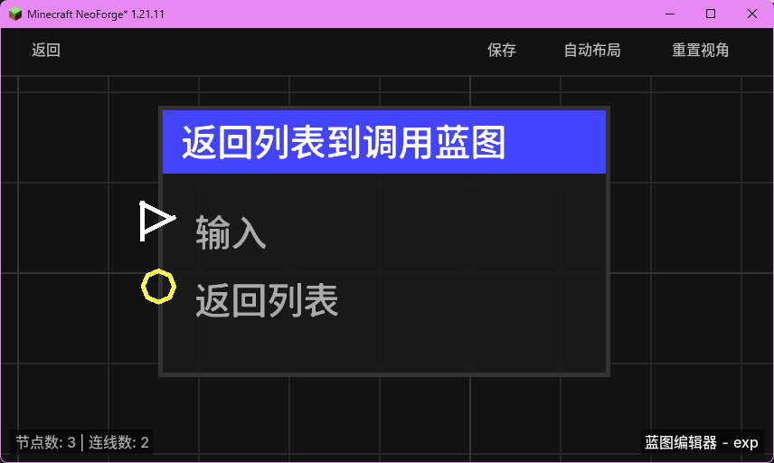

# 返回列表到调用蓝图 (Return List to Calling Blueprint)

将数据列表返回给调用当前蓝图的父蓝图。

## 节点概览
- **分类**: 逻辑 > 流程控制
- **内部ID**：`mgmc:return_to_caller`
- 

## 端口定义

### 输入 (Inputs)
| 端口名称 | 类型 | 说明 |
| :--- | :--- | :--- |
| **输入** (exec_in) | 执行流 (Exec) | 触发返回操作。 |
| **返回列表** (result_list) | 列表 (List) | 要返回给调用者的参数列表。 |

## 行为说明
1. **数据回传**：当此节点被触发时，它会将 `result_list` 中的内容存储到当前执行上下文中。调用者（父蓝图）可以在调用结束后，通过其“返回列表”端口获取这些数据。
2. **非强制中断**：触发此节点**并不会**立即停止当前蓝图的执行。如果希望在返回后立即结束，请确保此节点后不再连接其他逻辑。
3. **覆盖逻辑**：如果在同一个蓝图执行过程中多次触发此节点，后一次触发的返回值将覆盖前一次。
4. **空值处理**：如果 **返回列表** 未连接，调用者收到的将是一个空列表。
