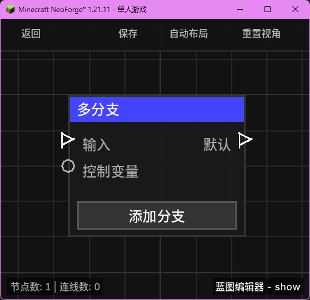

# 多分支 (Switch)

**多分支** 节点允许根据一个控制变量的值，从多个可能的输出路径中选择一个执行。它类似于编程语言中的 `switch` 或 `select` 语句，非常适合处理具有多种状态或选项的逻辑。

## 节点概览
- **分类**: 逻辑 > 流程控制
- **内部ID**：`mgmc:switch`
- 

## 端口定义

### 输入 (Inputs)
| 端口名称 | 类型 | 说明 |
| :--- | :--- | :--- |
| **输入** (Exec) | 执行流 | 触发该节点的运行。 |
| **控制变量** (Control) | 任意 (Any) | 用于匹配的分支依据。节点会将此值转换为字符串进行匹配。 |

### 输出 (Outputs)
| 端口名称 | 类型 | 说明 |
| :--- | :--- | :--- |
| **默认** (Default) | 执行流 | 当所有自定义分支都不匹配时触发。 |
| **(自定义分支)** | 执行流 | 用户通过“添加分支”按钮创建的动态端口。当控制变量等于端口 ID 时触发。 |

## 动态输出 (Dynamic Outputs)
该节点支持**动态端口**扩展：
1. **添加分支**：点击节点上的“添加分支”按钮，输入一个值（如 `1`, `apple`, `true` 等）。
2. **匹配逻辑**：
   - 节点运行时，获取“控制变量”的输入值并转换为字符串。
   - 遍历所有动态创建的输出端口。
   - 如果**控制变量字符串 == 端口 ID**，则从该端口流出执行流。
   - 如果没有任何匹配项，则从“默认”端口流出。

## 行为说明
1. **唯一性**：每次执行只会触发一个输出端口。
2. **类型转换**：匹配时采用字符串比较，因此请确保“控制变量”的输入内容与你设置的分支 ID 字符串一致。
