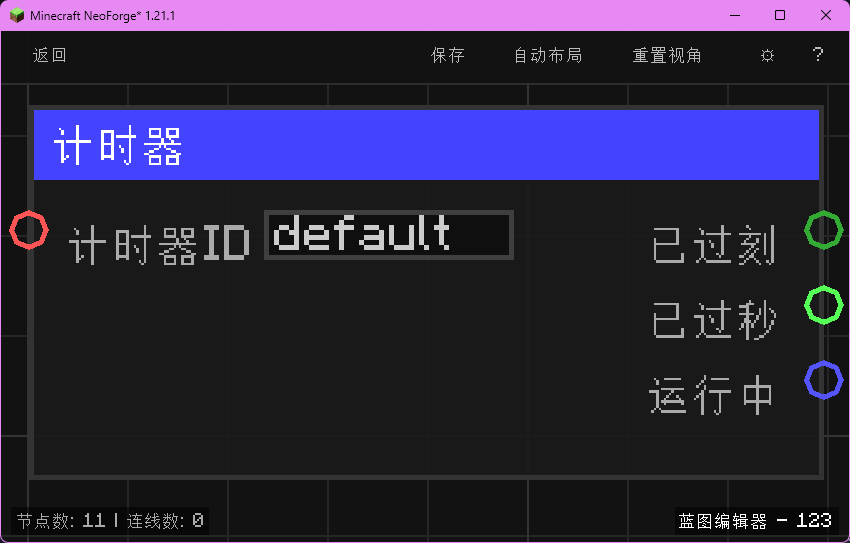

# 计时器 (Timer Get)

读取指定计时器（按计时器 ID）已累计的刻数、秒数与是否正在计时，并分别输出。

## 节点概览
- **分类**: 逻辑 > 流程控制
- **内部ID**：`mgmc:timer_get`
- 

## 端口定义

### 输入 (Inputs)
| 端口名称 | 类型 | 说明 |
| :--- | :--- | :--- |
| **计时器ID** (timer_id) | 字符串 (String) | 计时器的标识名称，用于区分多个并行的计时器。留空时默认使用 `"default"`。 |

### 输出 (Outputs)
| 端口名称 | 类型 | 说明 |
| :--- | :--- | :--- |
| **已过刻** (elapsed_ticks) | 整数 (Integer) | 计时器累计已过的游戏刻数（若仍在计时，包含从开始到当前游戏刻的增量）。最大为 `Integer.MAX_VALUE`。 |
| **已过秒** (elapsed_seconds) | 浮点数 (Float) | 计时器累计已过的秒数，按 1 秒 = 20 刻换算（即 `elapsedTicks / 20.0`）。 |
| **运行中** (running) | 布尔值 (Boolean) | 计时器当前是否处于运行中状态。 |

## 行为说明
1. **主要行为**：根据计时器 ID 读取对应计时器的状态，并分别输出累计刻数、累计秒数与运行状态。该节点没有执行流端口，可以在任意时刻读取当前计时数据。
2. **运行中累加**：若计时器当前处于运行状态（`running == true`），读取时会动态把从 `startTick` 到当前游戏刻的增量加入 `elapsedTicks`，确保读到的是“实时”数据。
3. **存储机制**：与 [计时器开始](logic/control/timer_start) 共用 `mgmc:timer_store` 存储结构，通过计时器 ID 隔离不同计时器的状态。
4. **空值处理**：**计时器ID (timer_id)** 为空字符串或未连接时，自动使用默认值 `"default"`。从未调用过该 ID 的“计时器开始”时，三个输出端口分别为 0、0.0、false。
5. **类型转换**：**计时器ID (timer_id)** 支持任意类型自动转换为字符串；**运行中 (running)** 可转换为整数（0/1）或字符串。