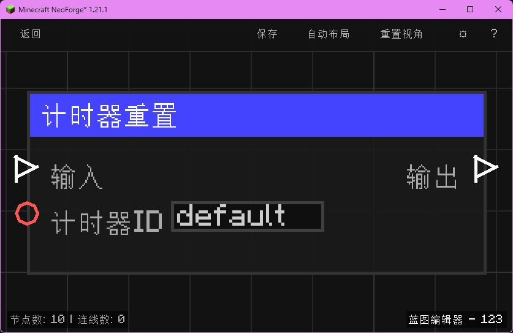

# 计时器重置 (Timer Reset)

清零并重置指定计时器（按计时器 ID）；随后继续执行。

## 节点概览
- **分类**: 逻辑 > 流程控制
- **内部ID**：`mgmc:timer_reset`
- 

## 端口定义

### 输入 (Inputs)
| 端口名称 | 类型 | 说明 |
| :--- | :--- | :--- |
| **输入** (exec_in) | 执行流 (Exec) | 触发节点执行。 |
| **计时器ID** (timer_id) | 字符串 (String) | 计时器的标识名称，用于区分多个并行的计时器。留空时默认使用 `"default"`。 |

### 输出 (Outputs)
| 端口名称 | 类型 | 说明 |
| :--- | :--- | :--- |
| **输出** (exec_out) | 执行流 (Exec) | 完成重置后继续执行。 |

## 行为说明
1. **主要行为**：根据计时器 ID 将对应计时器的 `elapsedTicks`、`startTick`、`running` 三个状态字段全部归零，等同于“从未启动过”。
2. **存储机制**：与 [计时器开始](logic/control/timer_start) 共用 `mgmc:timer_store` 存储结构；重置操作仅清理指定 ID 的计时器，不影响其他计时器。
3. **空值处理**：**计时器ID (timer_id)** 为空字符串或未连接时，自动使用默认值 `"default"`。
4. **类型转换**：**计时器ID (timer_id)** 支持任意类型自动转换为字符串。