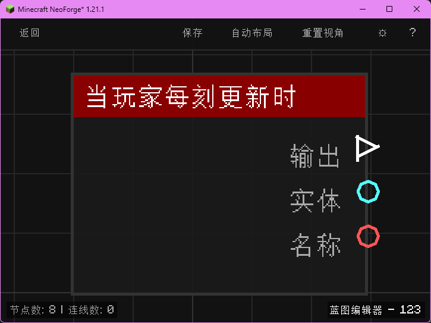

# 计时器开始 (Timer Start)

开始计时（按计时器 ID），若已在计时则不影响；随后继续执行。

## 节点概览
- **分类**: 逻辑 > 流程控制
- **内部ID**：`mgmc:timer_start`
- 

## 端口定义

### 输入 (Inputs)
| 端口名称 | 类型 | 说明 |
| :--- | :--- | :--- |
| **输入** (exec_in) | 执行流 (Exec) | 触发节点执行。 |
| **计时器ID** (timer_id) | 字符串 (String) | 计时器的标识名称，用于区分多个并行的计时器。留空时默认使用 `"default"`。 |

### 输出 (Outputs)
| 端口名称 | 类型 | 说明 |
| :--- | :--- | :--- |
| **输出** (exec_out) | 执行流 (Exec) | 设置计时开始状态后继续执行。 |

## 行为说明
1. **主要行为**：根据计时器 ID 启动一个独立计时器，记录当前世界游戏刻作为开始时间，并立即触发执行流继续向下执行。
2. **存储机制**：计时器的所有状态（开始刻、累计刻、是否运行）以 **计时器ID (timer_id)** 为键，存储在当前蓝图执行上下文的 `properties` 字段中（键名 `mgmc:timer_store`），不会持久化到存档，跨蓝图调用时通过 `parentContext` 传递上下文可继承。
3. **重复启动**：若对应 ID 的计时器已经在运行中，再次执行“开始”不会重置累计时间，也不会重新设定开始刻，保持现有运行状态。
4. **空值处理**：**计时器ID (timer_id)** 为空字符串或未连接时，自动使用默认值 `"default"`。
5. **类型转换**：**计时器ID (timer_id)** 支持任意类型自动转换为字符串。