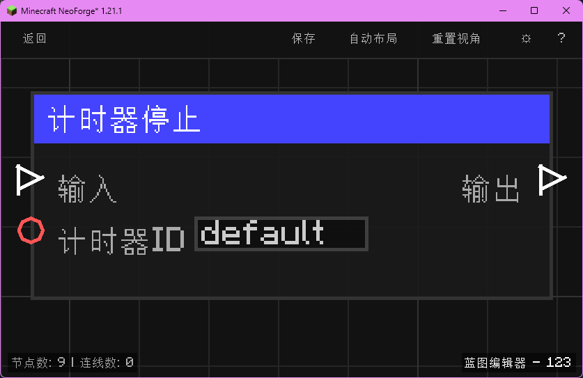

# 计时器停止 (Timer Stop)

停止计时（按计时器 ID）并累计已经过的时间；随后继续执行。

## 节点概览
- **分类**: 逻辑 > 流程控制
- **内部ID**：`mgmc:timer_stop`
- 

## 端口定义

### 输入 (Inputs)
| 端口名称 | 类型 | 说明 |
| :--- | :--- | :--- |
| **输入** (exec_in) | 执行流 (Exec) | 触发节点执行。 |
| **计时器ID** (timer_id) | 字符串 (String) | 计时器的标识名称，用于区分多个并行的计时器。留空时默认使用 `"default"`。 |

### 输出 (Outputs)
| 端口名称 | 类型 | 说明 |
| :--- | :--- | :--- |
| **输出** (exec_out) | 执行流 (Exec) | 完成停止与时间累计后继续执行。 |

## 行为说明
1. **主要行为**：根据计时器 ID 停止对应计时器，把从开始刻到当前游戏刻经过的刻数累加到 `elapsedTicks` 中，并将运行状态标记为 false。
2. **存储机制**：与 [计时器开始](logic/control/timer_start) 共用 `mgmc:timer_store` 存储结构，通过计时器 ID 隔离不同计时器的状态。
3. **重复停止**：若对应 ID 的计时器当前未在运行，再次执行“停止”不会产生任何副作用。
4. **空值处理**：**计时器ID (timer_id)** 为空字符串或未连接时，自动使用默认值 `"default"`。
5. **类型转换**：**计时器ID (timer_id)** 支持任意类型自动转换为字符串。