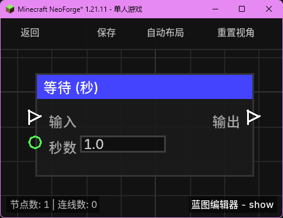

# 等待 (秒) (Wait Second)

**等待 (秒)** 节点允许你将执行流延迟指定的秒数。它是最常用的时间控制节点，适用于大多数非精确到刻的延时需求。

## 节点概览
- **分类**: 逻辑 > 流程控制
- **内部ID**：`mgmc:wait_s`
- 

## 端口定义

### 输入 (Inputs)
| 端口名称 | 类型 | 说明 |
| :--- | :--- | :--- |
| **输入** (Exec) | 执行流 | 触发该节点的运行，开始计时。 |
| **秒数** (Seconds) | 浮点数 (Float) | 等待的时间（秒）。默认为 `1.0`。 |

### 输出 (Outputs)
| 端口名称 | 类型 | 说明 |
| :--- | :--- | :--- |
| **输出** (Exec) | 执行流 | 在指定的等待时间结束后触发。 |

## 行为说明
1. **时间转换**：节点会自动将输入的秒数乘以 20 转换为游戏刻（Ticks）。例如，输入 `1.5` 秒将等待 `30` 刻。
2. **异步调度**：使用 `TickScheduler` 进行调度，不会阻塞服务器。
3. **零延迟处理**：如果输入的秒数导致计算出的刻数小于或等于 0，执行流将立即触发输出。
4. **TPS 相关性**：由于内部转换为游戏刻执行，等待的实际时长会随服务器 TPS 波动。在标准 20 TPS 下，1 秒即为现实中的 1 秒。
