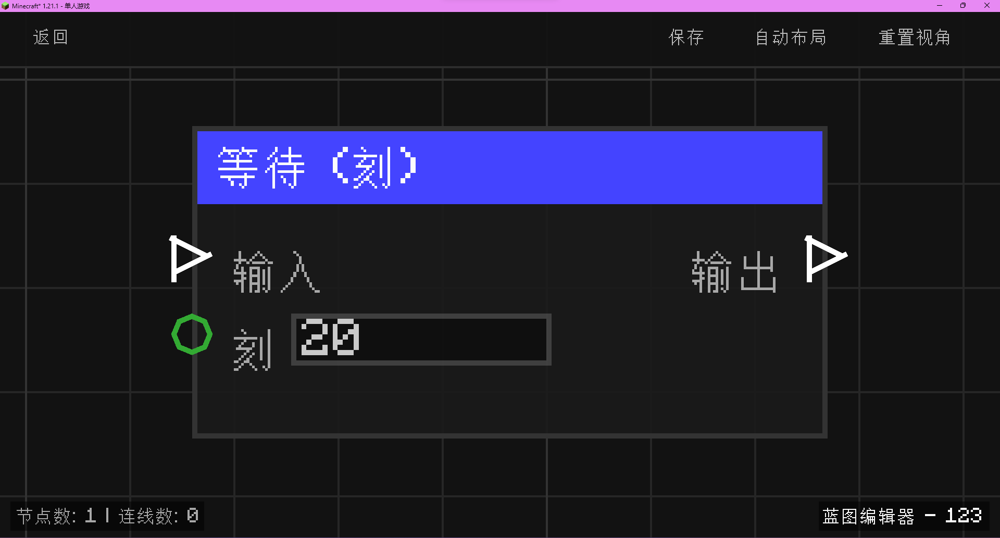

# 等待 (刻) (Wait Tick)

**等待 (刻)** 节点允许你将执行流延迟指定的 Minecraft 游戏刻（Ticks）。这在需要精确控制时序或制作简单的延时效果时非常有用。

## 节点概览
- **分类**: 逻辑 > 流程控制
- **内部ID**：`mgmc:wait_tick`
- 

## 端口定义

### 输入 (Inputs)
| 端口名称 | 类型 | 说明 |
| :--- | :--- | :--- |
| **输入** (Exec) | 执行流 | 触发该节点的运行，开始计时。 |
| **刻** (Ticks) | 整数 (Int) | 等待的游戏刻数量。1 秒通常等于 20 刻。默认为 `20`。 |

### 输出 (Outputs)
| 端口名称 | 类型 | 说明 |
| :--- | :--- | :--- |
| **输出** (Exec) | 执行流 | 在指定的等待时间结束后触发。 |

## 行为说明
1. **异步调度**：该节点使用 `TickScheduler` 进行任务调度。触发后，执行流会在此处“暂停”，直到指定的刻数流逝。
2. **非阻塞**：虽然执行流被延迟了，但它不会阻塞服务器主线程或其他节点的执行。
3. **零延迟处理**：如果输入的刻数小于或等于 0，执行流将立即从输出端口流出，不进行任何等待。
4. **游戏同步**：等待时间受服务器 TPS（每秒刻数）影响。如果服务器卡顿，实际的现实时间可能会变长，但游戏刻数量保持不变。
