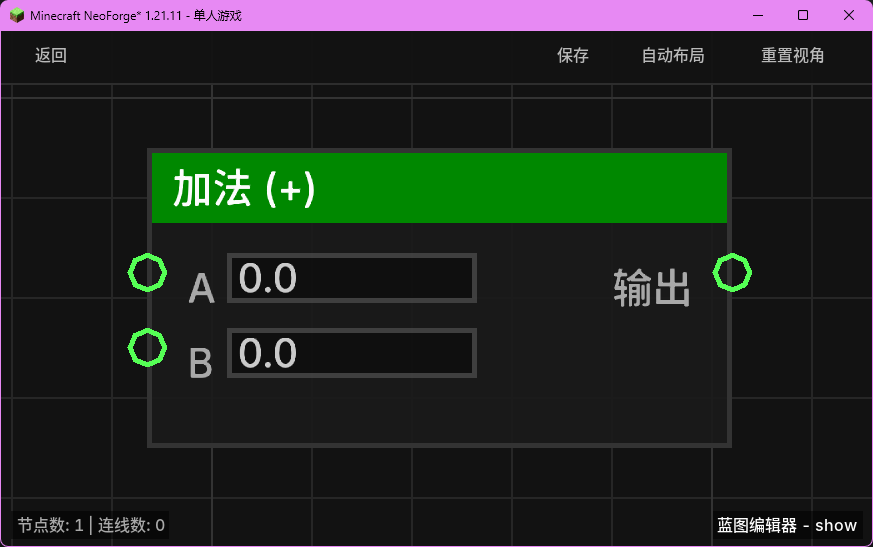

# 加法 (+)

## 概览
- **分类路径**：`逻辑 > 数学与转换`
- **内部 ID**：`add_float`
- 

对两个浮点数执行加法运算。

## 端口定义

| 端口名称 | 类型 | 语义描述 |
| :--- | :--- | :--- |
| **A** (A) | 浮点数 (Float) | 加数 A。默认为 `0.0`。 |
| **B** (B) | 浮点数 (Float) | 加数 B。默认为 `0.0`。 |
| **输出** (Result) | 浮点数 (Float) | 计算结果：`A + B`。 |

## 行为说明
- 该节点会对输入端口 **A** 和 **B** 的值进行实时求值，并返回它们的数学和。
- **自动类型转换**：如果输入的不是浮点数，系统会尝试将其转换为浮点数（例如整数、布尔值或可解析的字符串）。如果转换失败，该输入将被视为 `0.0`。
- **即时运算**：该节点属于数据节点，不包含执行流（Exec）。每当其输出端口被引用时，都会根据当前的输入值重新计算。
