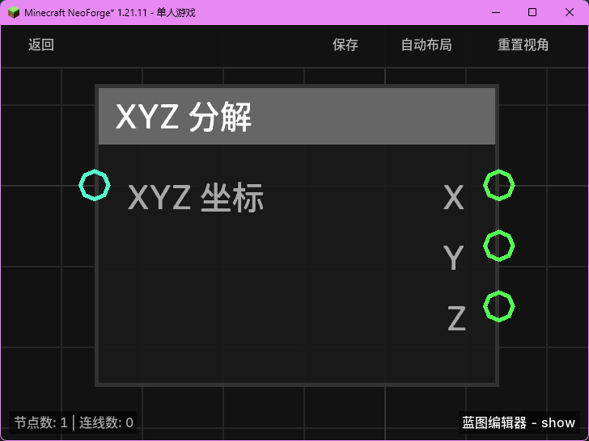

# XYZ 分解 (Break XYZ)

**XYZ 分解** 节点用于将一个统一的 `XYZ` 坐标对象拆分为三个独立的浮点数（X、Y、Z）。当你需要获取某个坐标的特定分量（例如只获取玩家的高度 Y）进行计算时，可以使用此节点。

## 节点概览
- **分类**: 逻辑 > 数学与转换
- **内部ID**：`mgmc:break_xyz`
- 

## 端口定义

### 输入 (Inputs)
| 端口名称 | 类型 | 说明 |
| :--- | :--- | :--- |
| **XYZ 坐标** (XYZ) | XYZ | 需要分解的原始 XYZ 坐标对象。 |

### 输出 (Outputs)
| 端口名称 | 类型 | 说明 |
| :--- | :--- | :--- |
| **X** (X) | 浮点数 (Float) | 坐标的 X 轴分量。 |
| **Y** (Y) | 浮点数 (Float) | 坐标的 Y 轴分量。 |
| **Z** (Z) | 浮点数 (Float) | 坐标的 Z 轴分量。 |

## 行为说明
1. **数据拆解**：该节点接收一个 `XYZ` 对象，并从中提取出 X、Y、Z 三个数值分别输出。
2. **实时计算**：这是一个纯值计算节点，不包含执行流。只要对应的输出端口（X、Y 或 Z）被引用，它就会实时从输入的坐标对象中提取对应分量。
3. **常见用途**：常用于判断位置关系（如检查高度 Y 是否大于某个值）或对坐标进行偏移计算（分解后再通过“创建 XYZ”组合）。
