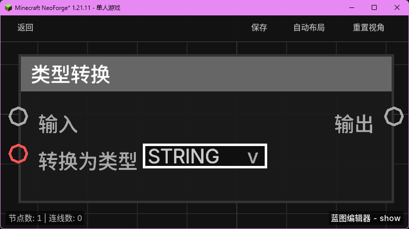

# 类型转换 (Cast)

**类型转换** 节点用于将一种数据类型的值显式转换为另一种数据类型。当节点之间的端口类型不匹配，或者你需要确保数据以特定格式处理时，可以使用此节点。

## 节点概览
- **分类**: 逻辑 > 数学与转换
- **内部ID**：`mgmc:cast`
- 

## 端口定义

### 输入 (Inputs)
| 端口名称 | 类型 | 说明 |
| :--- | :--- | :--- |
| **输入** (Input) | 任意 (Any) | 需要转换的原始数据。 |
| **转换为类型** (To Type) | 字符串 (String) | 目标数据类型。可通过下拉菜单选择。 |

### 输出 (Outputs)
| 端口名称 | 类型 | 说明 |
| :--- | :--- | :--- |
| **输出** (Output) | 任意 (Any) | 转换后的数据。如果转换失败，可能会返回该类型的默认值。 |