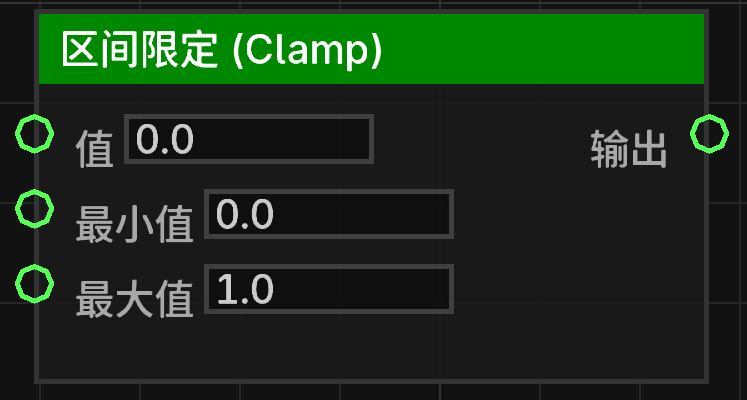

# 区间限定 (Clamp) (clamp_float)

将输入的数值限制在指定的最小值和最大值之间。

## 节点概览
- **分类**: 逻辑 > 数学与转换
- **内部ID**：`mgmc:clamp_float`
- 

## 端口定义

### 输入 (Inputs)
| 端口名称 | 类型 | 说明 |
| :--- | :--- | :--- |
| **值** (value) | 浮点数 (Float) | 需要限制范围的原始数值。 |
| **最小值** (min) | 浮点数 (Float) | 允许的最小数值。 |
| **最大值** (max) | 浮点数 (Float) | 允许的最大数值。 |

### 输出 (Outputs)
| 端口名称 | 类型 | 说明 |
| :--- | :--- | :--- |
| **输出** (result) | 浮点数 (Float) | 处理后的数值。如果原始值小于最小值，则返回最小值；如果大于最大值，则返回最大值；否则返回原始值。 |

## 行为说明
1. **主要行为**：该节点执行 `Math.max(min, Math.min(max, value))` 逻辑。
2. **默认值说明**：
   - **值**：默认为 `0.0`。
   - **最小值**：默认为 `0.0`。
   - **最大值**：默认为 `1.0`。
3. **即时运算**：该节点属于数据节点，不包含执行流（Exec）。每当其输出端口被引用时，都会根据当前的输入值重新计算。
