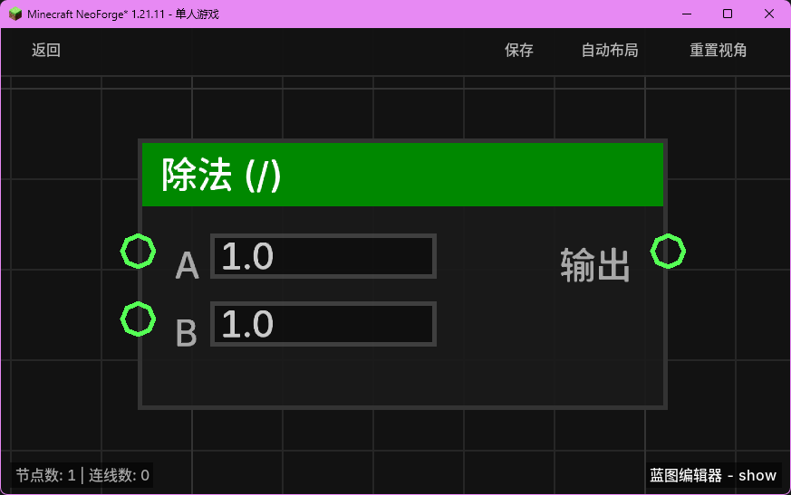

# 除法 (/) (div_float)

对两个浮点数执行除法运算。

## 节点概览
- **分类**: 逻辑 > 数学与转换
- **内部ID**：`mgmc:div_float`
- 

## 端口定义

### 输入 (Inputs)
| 端口名称 | 类型 | 说明 |
| :--- | :--- | :--- |
| **A** (a) | 浮点数 (Float) | 被除数。默认为 `1.0`。 |
| **B** (b) | 浮点数 (Float) | 除数。默认为 `1.0`。 |

### 输出 (Outputs)
| 端口名称 | 类型 | 说明 |
| :--- | :--- | :--- |
| **输出** (result) | 浮点数 (Float) | 计算结果：`A / B`。 |

## 行为说明
1. **主要行为**：该节点会对输入端口 **A** 和 **B** 的值进行实时求值，并返回它们的数学商（A / B）。
2. **除零保护**：**必须深究具体的代码实现**：代码逻辑为 `b != 0 ? a / b : 0.0`。这意味着当除数 **B** 为 `0` 时，节点不会抛出异常或产生无限大值，而是安全地返回 `0.0`。
3. **默认值说明**：输入端口默认值被设定为 `1.0`。如果端口未连接，计算将按 `1.0 / 1.0` 执行。
4. **空值处理**：如果输入端口接收到 `null`，该输入将被视为 `0.0`（由 `TypeConverter` 处理）。注意，如果 **B** 为 `null`（即 `0.0`），将触发除零保护返回 `0.0`。
5. **类型转换**：支持将布尔值、整数或可解析的字符串自动转换为浮点数。
6. **即时运算**：该节点属于数据节点，不包含执行流（Exec）。每当其输出端口被引用时，都会根据当前的输入值重新计算。
