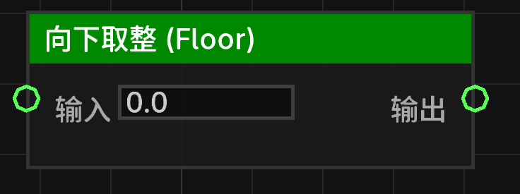

# 向下取整 (Floor) (floor_float)

返回小于或等于给定浮点数的最大整数。

## 节点概览
- **分类**: 逻辑 > 数学与转换
- **内部ID**：`mgmc:floor_float`
- 

## 端口定义

### 输入 (Inputs)
| 端口名称 | 类型 | 说明 |
| :--- | :--- | :--- |
| **输入** (input) | 浮点数 (Float) | 需要向下取整的数值。 |

### 输出 (Outputs)
| 端口名称 | 类型 | 说明 |
| :--- | :--- | :--- |
| **输出** (result) | 浮点数 (Float) | 向下取整后的结果（例如：3.8 -> 3.0, -3.2 -> -4.0）。 |

## 行为说明
1. **主要行为**：该节点返回不大于输入值的最大整数。
2. **即时运算**：该节点属于数据节点，不包含执行流（Exec）。每当其输出端口被引用时，都会根据当前的输入值重新计算。
