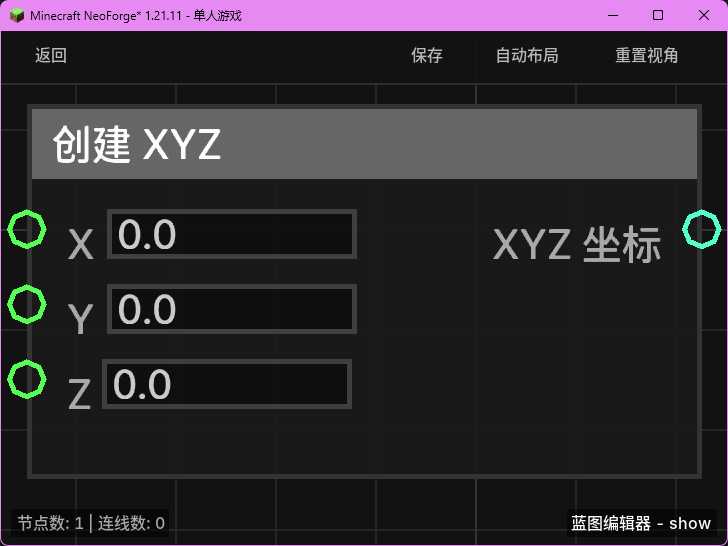

# 创建 XYZ (Make XYZ)

**创建 XYZ** 节点用于将三个独立的浮点数（X、Y、Z）组合成一个统一的 `XYZ` 坐标对象。这在需要指定位置信息（如传送、生成实体或设置方块）时非常有用。

## 节点概览
- **分类**: 逻辑 > 数学与转换
- **内部ID**：`mgmc:make_xyz`
- 

## 端口定义

### 输入 (Inputs)
| 端口名称 | 类型 | 说明 |
| :--- | :--- | :--- |
| **X** (X) | 浮点数 (Float) | 坐标的 X 轴分量。默认为 `0.0`。 |
| **Y** (Y) | 浮点数 (Float) | 坐标的 Y 轴分量。默认为 `0.0`。 |
| **Z** (Z) | 浮点数 (Float) | 坐标的 Z 轴分量。默认为 `0.0`。 |

### 输出 (Outputs)
| 端口名称 | 类型 | 说明 |
| :--- | :--- | :--- |
| **XYZ 坐标** (XYZ) | XYZ | 组合后的 XYZ 坐标对象。 |

## 行为说明
1. **数据组合**：该节点接收三个独立的数字输入，并将它们封装进一个 `XYZ` 数据包中。
2. **纯值处理**：这是一个纯值计算节点，不包含执行流。只要输出端口被引用，它就会根据当前的输入值实时计算并输出结果。
3. **坐标用途**：生成的 `XYZ` 坐标可以连接到任何需要坐标输入的节点，例如“传送实体”或“产生爆炸”。
