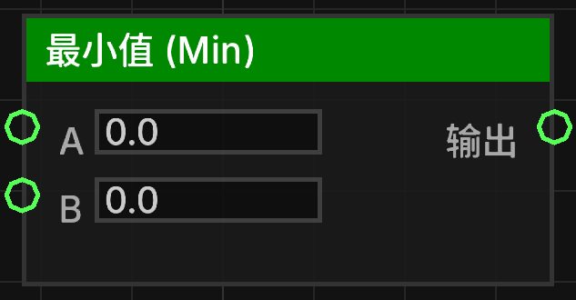

# 最小值 (Min) (min_float)

返回两个浮点数中的最小值。

## 节点概览
- **分类**: 逻辑 > 数学与转换
- **内部ID**：`mgmc:min_float`
- 

## 端口定义

### 输入 (Inputs)
| 端口名称 | 类型 | 说明 |
| :--- | :--- | :--- |
| **A** (a) | 浮点数 (Float) | 第一个比较值。 |
| **B** (b) | 浮点数 (Float) | 第二个比较值。 |

### 输出 (Outputs)
| 端口名称 | 类型 | 说明 |
| :--- | :--- | :--- |
| **输出** (result) | 浮点数 (Float) | 计算结果：`Math.min(A, B)`。 |

## 行为说明
1. **主要行为**：比较输入端口 **A** 和 **B** 的值，并返回其中较小的一个。
2. **即时运算**：该节点属于数据节点，不包含执行流（Exec）。每当其输出端口被引用时，都会根据当前的输入值重新计算。
