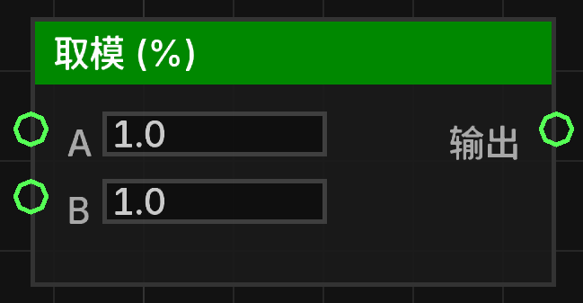

# 取模 (%) (mod_float)

对两个浮点数执行取模（取余）运算。

## 节点概览
- **分类**: 逻辑 > 数学与转换
- **内部ID**：`mgmc:mod_float`
- 

## 端口定义

### 输入 (Inputs)
| 端口名称 | 类型 | 说明 |
| :--- | :--- | :--- |
| **A** (a) | 浮点数 (Float) | 被除数。 |
| **B** (b) | 浮点数 (Float) | 除数。 |

### 输出 (Outputs)
| 端口名称 | 类型 | 说明 |
| :--- | :--- | :--- |
| **输出** (result) | 浮点数 (Float) | 计算结果：`A % B`。 |

## 行为说明
1. **主要行为**：该节点返回 **A** 除以 **B** 后的余数。
2. **除零保护**：**必须深究具体的代码实现**：代码逻辑为 `b != 0 ? a % b : 0.0`。如果除数 **B** 为 `0`，节点将安全地返回 `0.0`。
3. **默认值说明**：输入端口默认值被设定为 `1.0`。
4. **即时运算**：该节点属于数据节点，每当其输出端口被引用时，都会根据当前的输入值重新计算。
