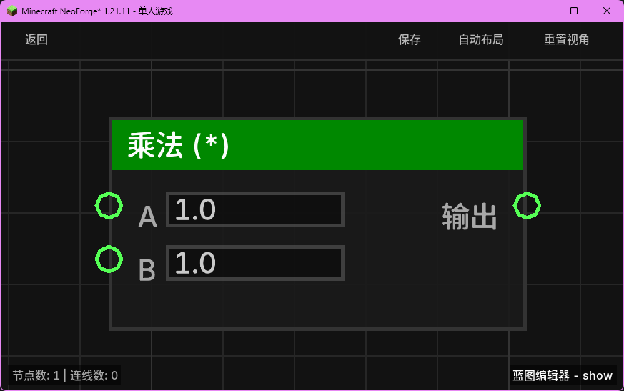

# 乘法 (*) (mul_float)

对两个浮点数执行乘法运算。

## 节点概览
- **分类**: 逻辑 > 数学与转换
- **内部ID**：`mgmc:mul_float`
- 

## 端口定义

### 输入 (Inputs)
| 端口名称 | 类型 | 说明 |
| :--- | :--- | :--- |
| **A** (a) | 浮点数 (Float) | 乘数 A。默认为 `1.0`。 |
| **B** (b) | 浮点数 (Float) | 乘数 B。默认为 `1.0`。 |

### 输出 (Outputs)
| 端口名称 | 类型 | 说明 |
| :--- | :--- | :--- |
| **输出** (result) | 浮点数 (Float) | 计算结果：`A * B`。 |

## 行为说明
1. **主要行为**：该节点会对输入端口 **A** 和 **B** 的值进行实时求值，并返回它们的数学乘积（A * B）。
2. **默认值说明**：与加法/减法不同，乘法节点的输入端口默认值被设定为 `1.0`，以确保在未连接任何端口时输出为 `1.0` 而非 `0.0`。
3. **空值处理**：如果输入端口接收到 `null`，该输入将被视为 `0.0`（由 `TypeConverter` 处理）。
4. **类型转换**：支持将布尔值、整数或可解析的字符串自动转换为浮点数。
5. **即时运算**：该节点属于数据节点，不包含执行流（Exec）。每当其输出端口被引用时，都会根据当前的输入值重新计算。
