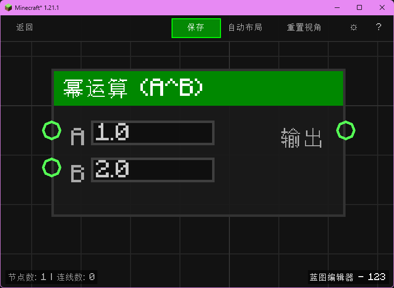

# 幂运算 (A^B) (Power (A^B))

对两个数执行幂运算，返回 A 的 B 次方。

## 节点概览
- **分类**: 逻辑 > 数学与转换
- **内部ID**：`mgmc:pow_float`
- 

## 端口定义

### 输入 (Inputs)
| 端口名称 | 类型 | 说明 |
| :--- | :--- | :--- |
| **A** (a) | 浮点数 (Float) | 底数。默认值为 `1.0`。 |
| **B** (b) | 浮点数 (Float) | 指数。默认值为 `2.0`。 |

### 输出 (Outputs)
| 端口名称 | 类型 | 说明 |
| :--- | :--- | :--- |
| **输出** (result) | 浮点数 (Float) | 计算结果 `A^B`。 |

## 行为说明
1. **主要行为**：节点在输出被读取时，对输入端口 A、B 进行求值并执行 `Math.pow(A, B)`，属于纯数据节点，不含执行流。
2. **空值处理**：当 A 或 B 未连接或求值为空时，`TypeConverter.toDouble` 会将其视为 `0.0`（但节点定义的默认值在编辑器中为 `A=1.0`、`B=2.0`）。
3. **类型转换**：输入值会经过 `TypeConverter.toDouble` 自动转换；数值与布尔值会转为数字，字符串会尝试解析为浮点数，无法解析时返回 `0.0`。
