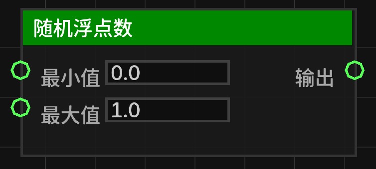

# 随机浮点数 (random_float)

在指定的最小值和最大值之间生成一个随机浮点数。

## 节点概览
- **分类**: 逻辑 > 数学与转换
- **内部ID**：`mgmc:random_float`
- 

## 端口定义

### 输入 (Inputs)
| 端口名称 | 类型 | 说明 |
| :--- | :--- | :--- |
| **最小值** (min) | 浮点数 (Float) | 随机数的下限（包含）。 |
| **最大值** (max) | 浮点数 (Float) | 随机数的上限（不包含）。 |

### 输出 (Outputs)
| 端口名称 | 类型 | 说明 |
| :--- | :--- | :--- |
| **输出** (result) | 浮点数 (Float) | 生成的随机浮点数。 |

## 行为说明
1. **主要行为**：该节点使用 `min + (max - min) * RANDOM.nextDouble()` 逻辑生成随机数。
2. **范围说明**：结果通常落在 `[min, max)` 范围内。
3. **默认值说明**：
   - **最小值**：默认为 `0.0`。
   - **最大值**：默认为 `1.0`。
4. **即时运算**：该节点属于数据节点，不包含执行流（Exec）。每当其输出端口被引用时，都会重新生成一个新的随机数。
