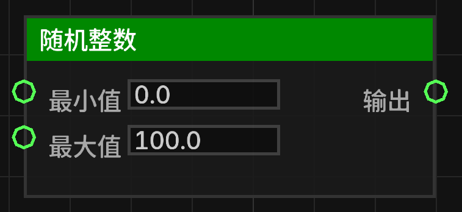

# 随机整数 (random_int)

在指定的最小值和最大值之间生成一个随机整数。

## 节点概览
- **分类**: 逻辑 > 数学与转换
- **内部ID**：`mgmc:random_int`
- 

## 端口定义

### 输入 (Inputs)
| 端口名称 | 类型 | 说明 |
| :--- | :--- | :--- |
| **最小值** (min) | 浮点数 (Float) | 随机数的下限（包含）。输入将被转换为整数。 |
| **最大值** (max) | 浮点数 (Float) | 随机数的上限（包含）。输入将被转换为整数。 |

### 输出 (Outputs)
| 端口名称 | 类型 | 说明 |
| :--- | :--- | :--- |
| **输出** (result) | 浮点数 (Float) | 生成的随机整数（以浮点数形式输出）。 |

## 行为说明
1. **主要行为**：该节点在 `[min, max]` 范围内生成一个均匀分布的随机整数。
2. **边界逻辑**：
   - 如果 **最大值** 小于或等于 **最小值**，则始终返回 **最小值**。
   - 使用 `min + RANDOM.nextInt(max - min + 1)` 确保包含最大值。
3. **默认值说明**：
   - **最小值**：默认为 `0.0`。
   - **最大值**：默认为 `100.0`。
4. **即时运算**：该节点属于数据节点，不包含执行流（Exec）。每当其输出端口被引用时，都会重新生成一个新的随机整数。
