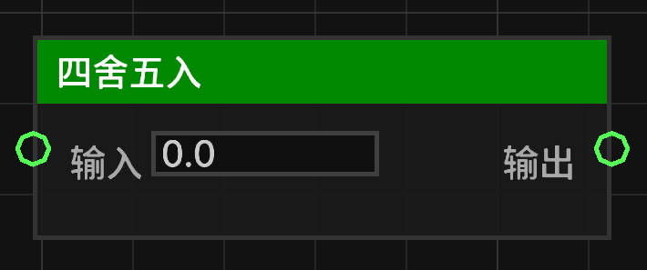

# 四舍五入 (round_float)

将给定的浮点数四舍五入为最接近的整数。

## 节点概览
- **分类**: 逻辑 > 数学与转换
- **内部ID**：`mgmc:round_float`
- 

## 端口定义

### 输入 (Inputs)
| 端口名称 | 类型 | 说明 |
| :--- | :--- | :--- |
| **输入** (input) | 浮点数 (Float) | 需要进行四舍五入的数值。 |

### 输出 (Outputs)
| 端口名称 | 类型 | 说明 |
| :--- | :--- | :--- |
| **输出** (result) | 浮点数 (Float) | 四舍五入后的整数值。 |

## 行为说明
1. **主要行为**：该节点使用 `Math.round(v)` 逻辑。如果小数部分大于或等于 0.5，则向上取整；否则向下取整。
2. **即时运算**：该节点属于数据节点，不包含执行流（Exec）。每当其输出端口被引用时，都会根据当前的输入值重新计算。
