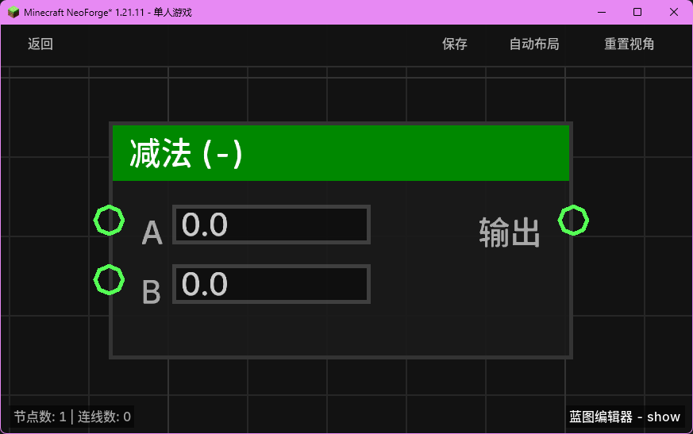

# 减法 (-) (sub_float)

对两个浮点数执行减法运算。

## 节点概览
- **分类**: 逻辑 > 数学与转换
- **内部ID**：`mgmc:sub_float`
- 

## 端口定义

### 输入 (Inputs)
| 端口名称 | 类型 | 说明 |
| :--- | :--- | :--- |
| **A** (a) | 浮点数 (Float) | 被减数。默认为 `0.0`。 |
| **B** (b) | 浮点数 (Float) | 减数。默认为 `0.0`。 |

### 输出 (Outputs)
| 端口名称 | 类型 | 说明 |
| :--- | :--- | :--- |
| **输出** (result) | 浮点数 (Float) | 计算结果：`A - B`。 |

## 行为说明
1. **主要行为**：该节点会对输入端口 **A** 和 **B** 的值进行实时求值，并返回它们的数学差值（A - B）。
2. **空值处理**：如果输入端口未连接且无默认值，或者输入为 `null`，则该输入将被视为 `0.0`。
3. **类型转换**：如果输入的不是浮点数，系统会尝试将其转换为浮点数（例如整数、布尔值或可解析的字符串）。如果转换失败，该输入将被视为 `0.0`。
4. **即时运算**：该节点属于数据节点，不包含执行流（Exec）。每当其输出端口被引用时，都会根据当前的输入值重新计算。
