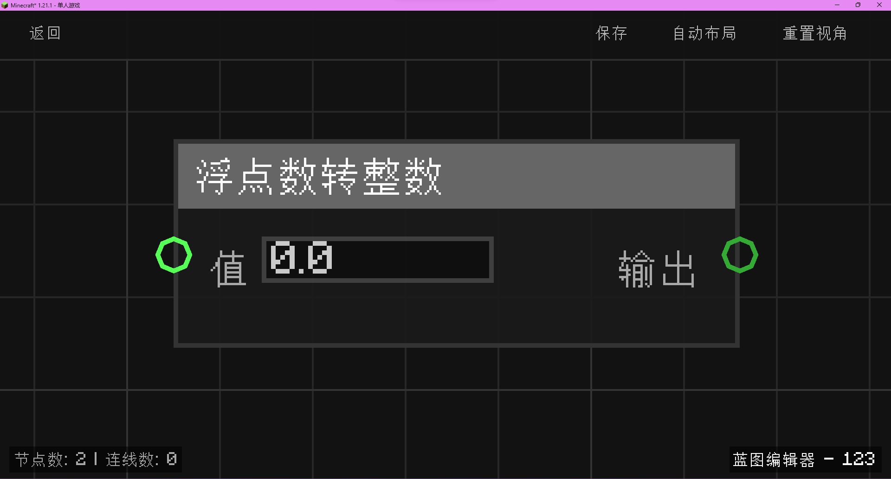

# 浮点数转整数 (to_int)

将输入的数值显式转换为整数类型。

## 节点概览
- **分类**: 逻辑 > 数学与转换
- **内部ID**：`mgmc:to_int`
- 

## 端口定义

### 输入 (Inputs)
| 端口名称 | 类型 | 说明 |
| :--- | :--- | :--- |
| **值** (value) | 浮点数 (Float) | 需要转换的原始数值或对象。 |

### 输出 (Outputs)
| 端口名称 | 类型 | 说明 |
| :--- | :--- | :--- |
| **输出** (output) | 整数 (Int) | 转换后的整数结果。 |

## 行为说明
1. **核心逻辑**：该节点调用 `TypeConverter.toInt()` 方法进行转换。
2. **转换规则**：
    - 如果输入是数字类型，将直接取其整数部分（截断）。
    - 如果输入是布尔值，`true` 转换为 `1`，`false` 转换为 `0`。
    - 如果输入是字符串，将尝试解析为数字并进行四舍五入。
3. **空值处理**：如果输入为 `null` 或未连接，输出默认为 `0`。
4. **内部实现**：虽然输出端口类型定义为 `INT`，但在 Java 内部实现中，为了保证与其他数值节点的连通性，返回值会被包装为 `double` 类型，但数值始终保持为整数。
