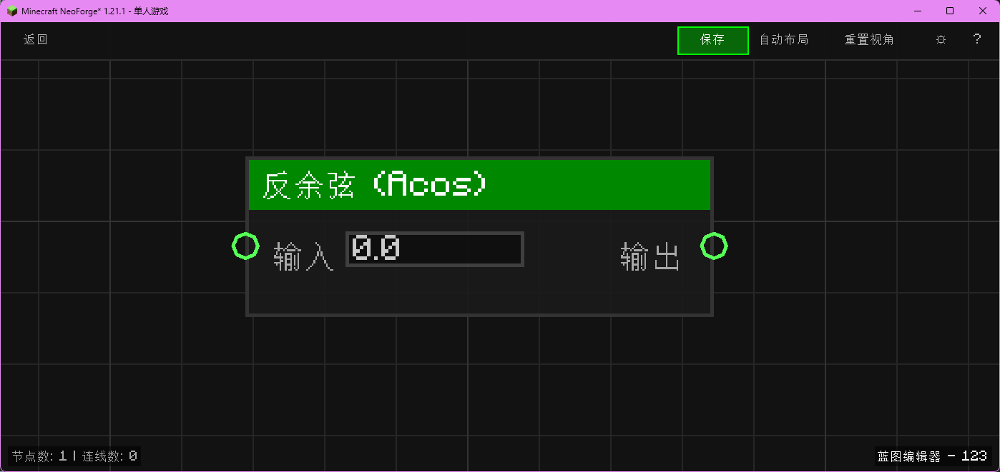

# 反余弦 (Acos)

计算数值的反余弦值。

## 节点概览
- **分类**: 逻辑 > 三角函数
- **内部ID**：`mgmc:acos`
- 

## 端口定义

### 输入 (Inputs)
| 端口名称 | 类型 | 说明 |
| :--- | :--- | :--- |
| **输入** (Input) | 浮点 (Float) | 余弦值（范围 -1.0 到 1.0）。 |

### 输出 (Outputs)
| 端口名称 | 类型 | 说明 |
| :--- | :--- | :--- |
| **结果** (Result) | 浮点 (Float) | 对应的角度（弧度制）。 |

## 行为说明
1. **主要行为**：计算 acos(x)。
2. **范围**：如果输入超出 [-1, 1] 范围，结果为 NaN。
