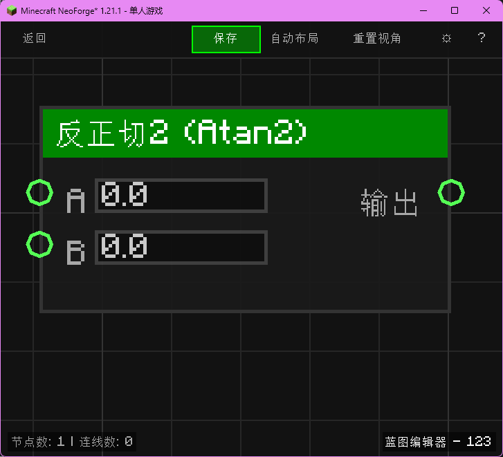

# 方位角 (Atan2)

计算坐标 (y, x) 的方位角。

## 节点概览
- **分类**: 逻辑 > 三角函数
- **内部ID**：`mgmc:atan2`
- 

## 端口定义

### 输入 (Inputs)
| 端口名称 | 类型 | 说明 |
| :--- | :--- | :--- |
| **A** (A) | 浮点 (Float) | 纵坐标 (y)。 |
| **B** (B) | 浮点 (Float) | 横坐标 (x)。 |

### 输出 (Outputs)
| 端口名称 | 类型 | 说明 |
| :--- | :--- | :--- |
| **结果** (Result) | 浮点 (Float) | 对应的角度（弧度制，范围 -π 到 π）。 |

## 行为说明
1. **主要行为**：计算 atan2(y, x)。
2. **注意**：第一个参数是 A (通常对应 y)，第二个参数是 B (通常对应 x)。
