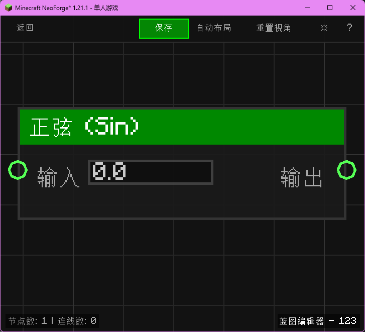

# 正弦 (Sin)

计算角度的正弦值。

## 节点概览
- **分类**: 逻辑 > 三角函数
- **内部ID**：`mgmc:sin`
- 

## 端口定义

### 输入 (Inputs)
| 端口名称 | 类型 | 说明 |
| :--- | :--- | :--- |
| **输入** (Input) | 浮点 (Float) | 角度（弧度制）。 |

### 输出 (Outputs)
| 端口名称 | 类型 | 说明 |
| :--- | :--- | :--- |
| **结果** (Result) | 浮点 (Float) | 输入角的正弦值。 |

## 行为说明
1. **主要行为**：计算 sin(x)。
2. **单位**：输入必须是弧度。如果需要使用角度，请先连接 `to_radians` 节点。
