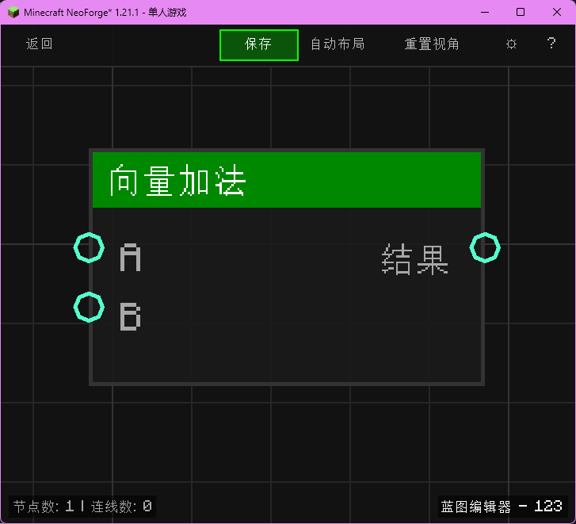

# 向量加法 (Vector Add)

计算两个向量的和。

## 节点概览
- **分类**: 逻辑 > 向量
- **内部ID**：`mgmc:vector_add`
- 

## 端口定义

### 输入 (Inputs)
| 端口名称 | 类型 | 说明 |
| :--- | :--- | :--- |
| **A** (A) | 坐标 (XYZ) | 第一个向量。 |
| **B** (B) | 坐标 (XYZ) | 第二个向量。 |

### 输出 (Outputs)
| 端口名称 | 类型 | 说明 |
| :--- | :--- | :--- |
| **结果** (Result) | 坐标 (XYZ) | A + B 的结果。 |

## 行为说明
1. **主要行为**：将两个向量的 X, Y, Z 分量分别相加。
