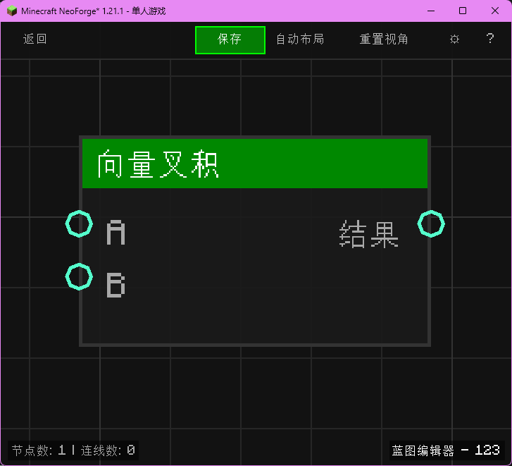

# 向量叉积 (Vector Cross Product)

计算两个向量的叉积。

## 节点概览
- **分类**: 逻辑 > 向量
- **内部ID**：`mgmc:vector_cross`
- 

## 端口定义

### 输入 (Inputs)
| 端口名称 | 类型 | 说明 |
| :--- | :--- | :--- |
| **A** (A) | 坐标 (XYZ) | 第一个向量。 |
| **B** (B) | 坐标 (XYZ) | 第二个向量。 |

### 输出 (Outputs)
| 端口名称 | 类型 | 说明 |
| :--- | :--- | :--- |
| **结果** (Result) | 坐标 (XYZ) | 叉积结果（向量）。 |

## 行为说明
1. **主要行为**：返回一个同时垂直于 A 和 B 的新向量。
2. **方向**：遵循右手定则。
