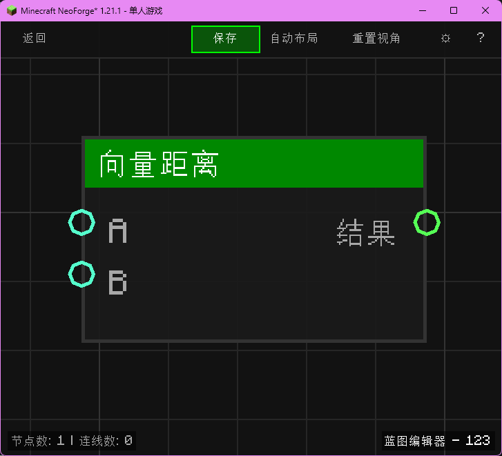

# 向量距离 (Vector Distance)

计算两个坐标点之间的距离。

## 节点概览
- **分类**: 逻辑 > 向量
- **内部ID**：`mgmc:vector_distance`
- 

## 端口定义

### 输入 (Inputs)
| 端口名称 | 类型 | 说明 |
| :--- | :--- | :--- |
| **A** (A) | 坐标 (XYZ) | 第一个点。 |
| **B** (B) | 坐标 (XYZ) | 第二个点。 |

### 输出 (Outputs)
| 端口名称 | 类型 | 说明 |
| :--- | :--- | :--- |
| **结果** (Result) | 浮点 (Float) | 两点之间的欧几里得距离。 |

## 行为说明
1. **主要行为**：计算 (A - B) 的长度。
