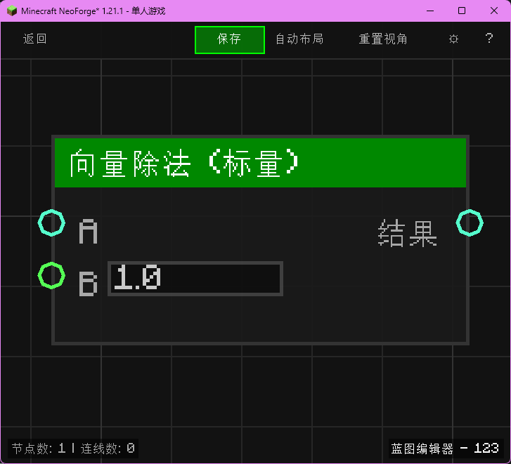

# 向量除法 (标量) (Vector Div Scalar)

将向量除以一个标量（数值）。

## 节点概览
- **分类**: 逻辑 > 向量
- **内部ID**：`mgmc:vector_div`
- 

## 端口定义

### 输入 (Inputs)
| 端口名称 | 类型 | 说明 |
| :--- | :--- | :--- |
| **A** (A) | 坐标 (XYZ) | 输入向量。 |
| **B** (B) | 浮点 (Float) | 除数（标量）。 |

### 输出 (Outputs)
| 端口名称 | 类型 | 说明 |
| :--- | :--- | :--- |
| **结果** (Result) | 坐标 (XYZ) | A / B 的结果。 |

## 行为说明
1. **主要行为**：将向量的每个分量除以标量 B。
2. **特殊情况**：如果 B 为 0，返回零向量 (0, 0, 0)。
