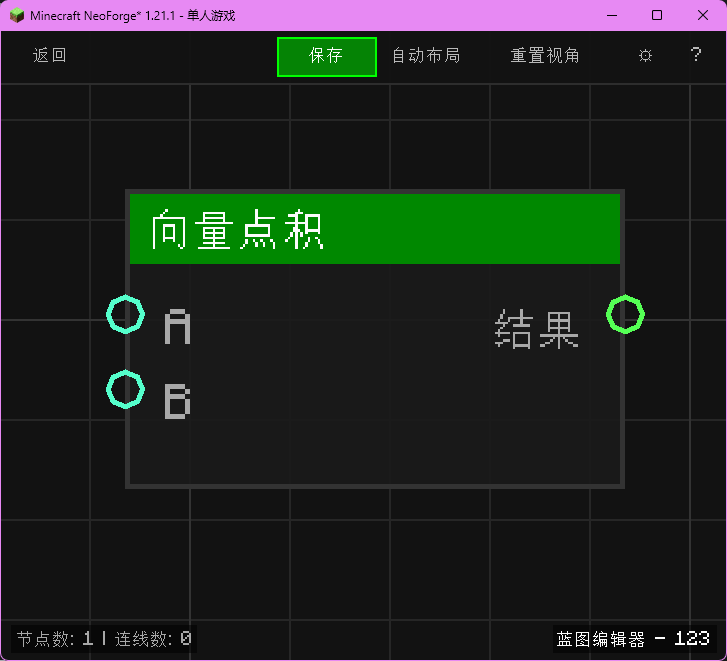

# 向量点积 (Vector Dot Product)

计算两个向量的点积。

## 节点概览
- **分类**: 逻辑 > 向量
- **内部ID**：`mgmc:vector_dot`
- 

## 端口定义

### 输入 (Inputs)
| 端口名称 | 类型 | 说明 |
| :--- | :--- | :--- |
| **A** (A) | 坐标 (XYZ) | 第一个向量。 |
| **B** (B) | 坐标 (XYZ) | 第二个向量。 |

### 输出 (Outputs)
| 端口名称 | 类型 | 说明 |
| :--- | :--- | :--- |
| **结果** (Result) | 浮点 (Float) | 点积结果（标量）。 |

## 行为说明
1. **主要行为**：计算 x1*x2 + y1*y2 + z1*z2。
2. **应用**：可用于计算夹角或投影。
