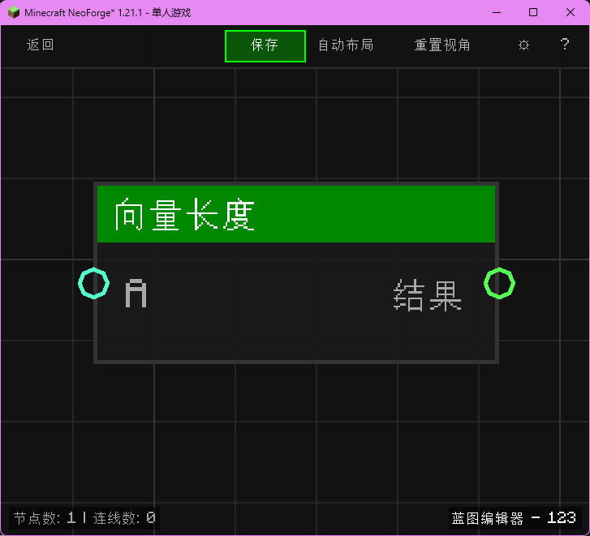

# 向量长度 (Vector Length)

计算向量的模（长度）。

## 节点概览
- **分类**: 逻辑 > 向量
- **内部ID**：`mgmc:vector_length`
- 

## 端口定义

### 输入 (Inputs)
| 端口名称 | 类型 | 说明 |
| :--- | :--- | :--- |
| **A** (A) | 坐标 (XYZ) | 输入向量。 |

### 输出 (Outputs)
| 端口名称 | 类型 | 说明 |
| :--- | :--- | :--- |
| **结果** (Result) | 浮点 (Float) | 向量的长度。 |

## 行为说明
1. **主要行为**：计算 sqrt(x*x + y*y + z*z)。
