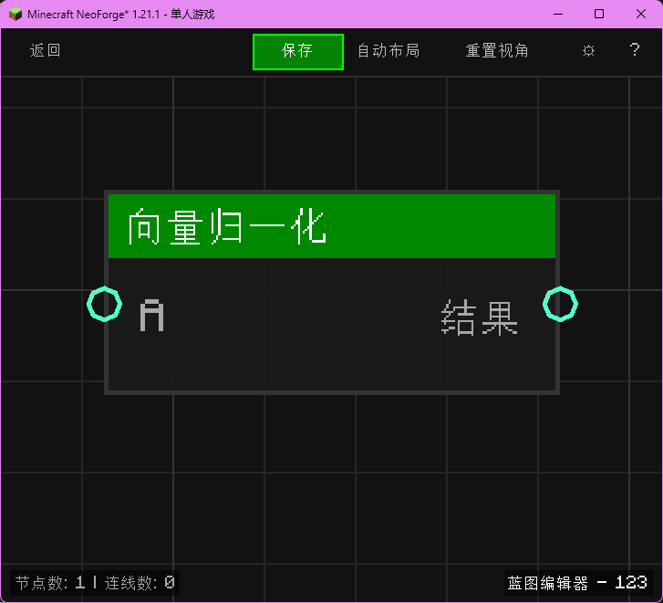

# 向量归一化 (Vector Normalize)

将向量转换为长度为 1 的单位向量。

## 节点概览
- **分类**: 逻辑 > 向量
- **内部ID**：`mgmc:vector_normalize`
- 

## 端口定义

### 输入 (Inputs)
| 端口名称 | 类型 | 说明 |
| :--- | :--- | :--- |
| **A** (A) | 坐标 (XYZ) | 输入向量。 |

### 输出 (Outputs)
| 端口名称 | 类型 | 说明 |
| :--- | :--- | :--- |
| **结果** (Result) | 坐标 (XYZ) | 归一化后的单位向量。 |

## 行为说明
1. **主要行为**：保持向量方向不变，将其长度缩放为 1。
2. **特殊情况**：如果输入为零向量，返回零向量。
